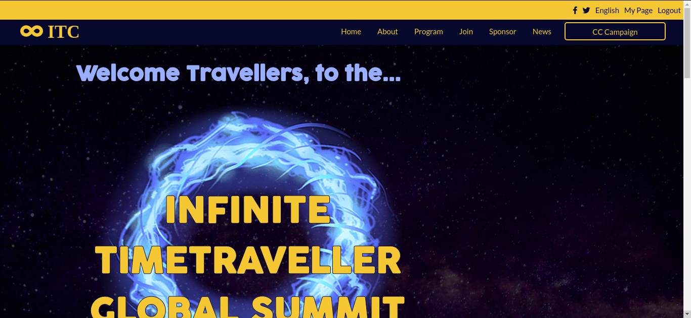

# Capstone
HTML &amp; CSS Capstone

In this project a full site will be made based of the graphic guidelines provided.

## 🔧 Built With

- HTML and CSS3.
- SASS.
- Vs COde.

## 🔴 Live Demo

[Live Demo Link](https://raw.githack.com/jurgen1c/Capstone/feature-branch/index.html)

## 🛠 Getting Started

To get a local copy up and running follow these simple example steps.

- Go to the main page of te repo.
- Press the "Code" button and get the repo link.
- Clone it using git.

## - Resources
 - Created based on the conference page layout by Cindy Shin.
 https://www.behance.net/gallery/29845175/CC-Global-Summit-2015

 - Color based of color phsycology & complementary relationship

 https://worqx.com/color/color_wheel.htm

 - Color Pallete

 

## ✒️ Author

👤 **Jurgen Clausen**

- Github: [@jurgen1c](https://github.com/jurgen1c)
- LinkenIn:[LinkenIn](https://www.linkedin.com/in/jurgen-clausen-2740061a9/)

## 🤝 Contributing

Contributions, issues and feature requests are welcome!

Feel free to check the [issues page](issues/).

## 📝 License

This project is [MIT](lic.url) licensed.
